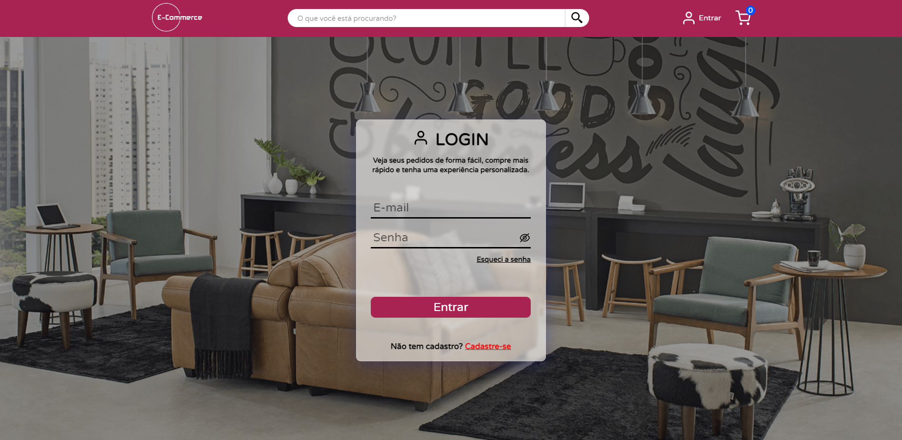

# E-Commerce with React

This project is an E-Commerce developed with the main objective of studying and practicing React. The proposal was to use as few external libraries as possible to have the opportunity to type the code and understand in detail the workings of the technologies used.

## Features

The E-Commerce has the following features:

- Product search: Users can search for available products in the E-Commerce.
- Shopping cart: Users can add and remove products from the shopping cart.
- Checkout: Users need to create an account, enter a delivery address, and select a payment method (Pix, boleto, or credit card) to complete the purchase.
- Delivery options: Users can choose between three types of delivery: standard, express, or pick up in-store.
- Categories: Users can access categories and view the products available in each category.
- Deals: Users can access the deals and see all the products on sale.

## Technologies Used

- [React](https://react.dev/): A JavaScript library for building user interfaces.
- [Redux](https://redux.js.org/): A state management library that helps maintain the application state in a centralized way.
- [React Router Dom](https://reactrouter.com/en/main): A library that allows navigation between different pages in a React application.
- [React-IMask](https://imask.js.org/): A library for formatting and validating inputs in React.
- [React-Icons](https://react-icons.github.io/react-icons/): A library that provides a collection of icons for use in React projects.

## Project Screenshots

Here are some screenshots of the project:

_On the project's homepage, you will find the latest discoveries of the day and the available categories. Right at the beginning, there is a navigation bar that provides various options, such as accessing your profile, creating a new account, viewing your shopping cart, or searching for a specific product. Additionally, you can explore different product categories and check out featured promotions. The navigation bar makes it easy to navigate and quickly access different sections of the project._

_On the categories page, you can see all the available products in the selected category._

_On the promotions page, you can check out all the discounted products._

_After searching for a product, the search page displays all the search results._

_When accessing your account page, you can view your order history. By clicking on an order, you can check its details. On your account page, you can also initiate exchanges, review and update your personal information, change your email, password, and address._

_You have the option to modify or delete your primary address. When making changes to your address, you can enter a ZIP code, and an API will verify its accuracy. If the ZIP code is correct, the remaining details will be automatically filled based on the provided ZIP code._

_On the product page, you can view detailed product information, choose a photo and zoom in to see it in detail, select the product color, and add it to the cart._

_When you go to your shopping cart, you will see all the items you have added, along with their details such as selected color, price, total value, and how much you are saving on the purchase (if there are items on sale). You can also increase the quantity of an item if you want to buy more than one, and you can remove a product from the list._

_Before finalizing the order, you can review all the information such as delivery address, total amount, choose a delivery method, check the selected items, and select the payment method. Please note that if you don't have a delivery address, you will need to provide one before finalizing the order._

_The order details page has all the information for a specific user order._

_The login page has a standard behavior, checking the email and password to ensure that both are correct before proceeding with the login._

_The form for registering a new user checks all the filled-in information, and if any email, CPF, and/or phone number have already been registered, it displays a warning, and the registration cannot be completed until the fields are correctly filled with data that does not exist in the system._

## How to Run the Project

Follow the steps below to run the project locally:

1. Clone the repository to your local machine.
2. In the terminal, navigate to the project's root directory.
3. Start the FAKE API using the command `npm run server`. Make sure the FAKE API is running on port 3000.
4. In another terminal, still in the project's root directory, run the command `npm start` to start the project.
5. Now you can access the E-Commerce locally in your browser.

**Important**: This project uses a FAKE API. Therefore, to run the project, you need to first start the Fake API using the command `npm run server` and open it on port 3000. Then, start the project using the command `npm start`.

## Acknowledgments

I would like to thank the development communities and the available resources that contributed to the completion of this project.
